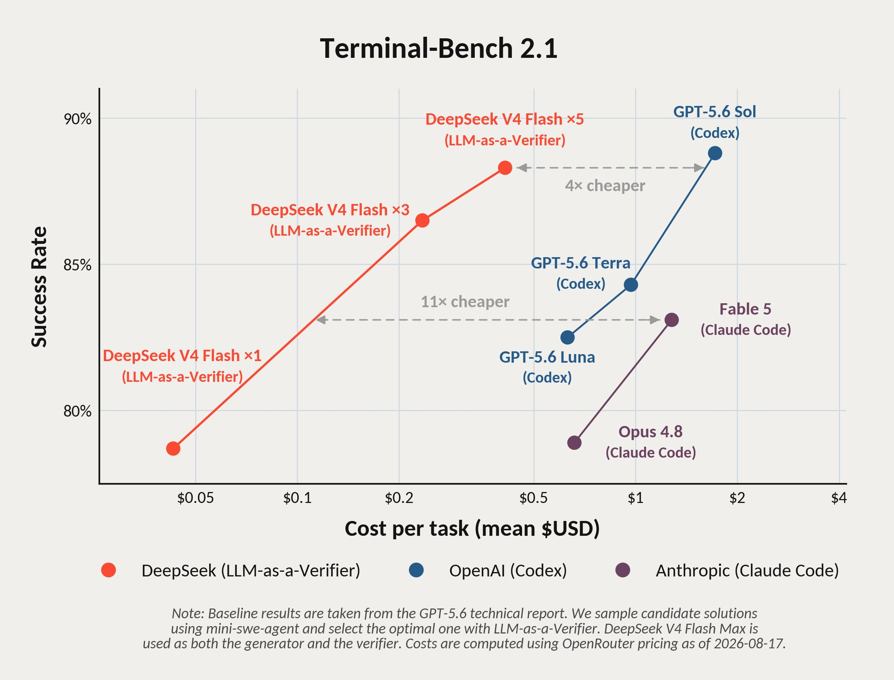

# SWARMS


> **Orquestación Local-First de Agentes de Código.**  
> Invierte inteligencia en planificar y revisar. Deja que un motor determinístico en Rust coordine modelos rápidos, gratuitos y open-weight en paralelo.

[](https://swarms-orchestrator.vercel.app/)
[](LICENSE)
[](https://github.com/Mchicao/swarm-driven-development)
[](README.md)

SWARMS es un orquestador local-first que te permite decidir **qué modelo planifica, qué modelo programa, qué modelo revisa y cuántos workers corren concurrentemente**. Funciona 100% offline de fábrica con mocks simulados y solo se conecta a CLIs y APIs cuando tú configuras tus rutas locales.

---

## La Prueba: Modelos Baratos, Resultados Premium



**Escalar la auto-verificación y rollouts paralelos hace que modelos open-weight y económicos superen a modelos frontera propietarios a una fracción del costo.**

### 1. Terminal-Bench 2.1 (DeepSeek V4 Flash)
- **79% → 88% de Precisión**: Muestrear 5 soluciones candidatas con DeepSeek V4 Flash y rankearlas con LLM-as-a-Verifier eleva la precisión de 79% a 88%.
- **11× Más Barato que Claude Fable 5**: Supera a Claude Fable 5 con el mismo nivel de precisión costando **11 veces menos** (~$0.50/tarea vs ~$5.50/tarea).
- **4× Más Barato que Codex GPT-5.6 Sol**.

### 2. DeepSWE Benchmark (Investigación Together AI · Zain Hasan)
- **Single-shot**: GLM (69.0%) vs Claude Fable 5 (69.7%).
- **2 Candidatos (Pass@2)**: GLM alcanza **81.1%** (superando el 77.1% de Fable 5).
- **4 Candidatos (Pass@4)**: GLM domina con **87.6%** (frente al 84.1% de Fable 5) con un costo ~10× inferior.

> Fuentes: [Investigación DeepSWE de Together AI por Zain Hasan (@zainhas)](https://x.com/zainhas/status/2091297526347677701) y el [estudio de auto-verificación LLM-as-a-Verifier](https://github.com/llm-as-a-verifier/llm-as-a-verifier#self-verification-terminal-bench-21).

---

## Rutas Gratuitas y Verificadas (Probadas en Agosto 2026)

Aprovecha rutas de agentes sin costo y sin riesgo de cargos sorpresa:

| Ruta | Modelo | Origen | Costo / Cuota |
|---|---|---|---|
| `ox_alpha_free` | `opencode/x-preview-f-free` — Ox Alpha Free | OpenCode Zen | **$0 (Ilimitado)** |
| `ox_alpha_hermes` | `stealth/ox-alpha` — Ox Alpha Promo | Nous Portal vía Hermes Agent | **$0 (Promo ilimitada)** |
| `gemini37_flash_medium` | Gemini 3.7 Flash (Medium) | Antigravity CLI | **$0 (Verificado)** |
| `muse_spark_free` | `opencode/muse-spark-1.2-contributor-free` (1M ctx) | OpenCode Zen | **$0 (Gratis)** |
| `deepseek_v4_flash` | DeepSeek V4 Flash | OpenRouter / API DeepSeek | **~$0.05 / tarea** |
| `glm_53` | GLM 5.3 (`zai-coding-plan/glm-5.3`) | Plan Z.AI vía OpenCode | Alto IQ para Plan/Code |

Ejecuta 4 workers concurrentes a costo cero:
```bash
cargo run --manifest-path rust/Cargo.toml -- run --force \
  --plan my_plan.json --global-max-concurrency 4 --provider-cap ox_alpha_free=4
```

---

## Capacidades y Funcionalidades Clave

### 🚀 Scaling Paralelo en Test-Time
Ejecuta N soluciones candidatas simultáneamente en git worktrees aislados.
1. **Objetivo Primero**: Las pruebas automatizadas (`pytest`, `cargo test`, linters) corren en cada candidato. Si un candidato pasa limpiamente, gana con **cero llamadas extra a LLMs**.
2. **LLM-as-a-Verifier**: En caso de empate, un modelo verificador rápido puntúa los candidatos.
3. **Escalamiento Controlado**: Casos ambiguos escalan a rutas de síntesis o revisión bajo presupuestos de tokens estrictos.

### 🛡️ Arquitectura Anti-Slop y Especialización de Roles
- **Planner Inteligente**: Usa modelos de alto razonamiento (Claude Fable, GPT-5.6, GLM) únicamente para formular planes de flujo DAG estáticos.
- **Crítico Estático**: Valida dependencias del grafo, ciclos y límites presupuestarios *antes* de iniciar la ejecución.
- **Workers Económicos**: Delega las tareas de código pesadas a workers rápidos y gratuitos (Ox Alpha, DeepSeek V4 Flash, Gemini Flash).
- **Verificador Determinístico**: Califica resultados con compiladores, pruebas unitarias y hashes SHA256.

### 🔒 Cero Contaminación del Espacio de Trabajo
Cada worker programador opera en un Git worktree temporal y aislado. Los cambios se validan criptográficamente con firmas SHA256 antes y después de aplicarse a la rama principal.

### ⏱️ Protección contra Procesos Colgados
Monitores activos vigilan los logs de cada worker. Si una tarea se detiene o queda en silencio, SWARMS emite advertencias y aplica límites de tiempo para evitar que procesos zombies consuman créditos.

### 🌐 Swarm-Driven Development (SwDD)
Integración nativa con [SwDD](https://github.com/Mchicao/swarm-driven-development) para conectar especificaciones OpenSpec, orquestación SWARMS, Gentle-AI y memoria Engram en un único flujo:
$$	ext{Especificación} \longrightarrow 	ext{Ejecución en Enjambre} \longrightarrow 	ext{Entrega Verificada}$$

---

## Inicio Rápido en 30 Segundos

SWARMS está construido en Rust nativo, autónomo y sin dependencias de Python:

```bash
# 1. Diagnóstico del entorno local
cargo run --manifest-path rust/Cargo.toml -- doctor

# 2. Revisión estática del plan
cargo run --manifest-path rust/Cargo.toml -- review --plan docs/workflow_plan_example.json

# 3. Dry-run sin efectos secundarios
cargo run --manifest-path rust/Cargo.toml -- dry-run --plan docs/workflow_plan_example.json --force

# 4. Ejecución con límites de concurrencia
cargo run --manifest-path rust/Cargo.toml -- run --plan docs/workflow_plan_example.json --force --global-max-concurrency 3 --provider-cap mock=3
```

---

## Ecosistema e Integraciones

- **CLIs y Agentes**: Claude Code, Codex CLI, OpenCode, Kilo Code, Hermes Agent, Antigravity CLI.
- **APIs y Pasarelas**: APIs compatibles con OpenAI, pasarelas LiteLLM, OpenRouter, Z.AI, Nous Portal.
- **Modo Offline / CI**: Provider `mock` autocontenido para pruebas locales, demostraciones y CI/CD.
- **Telemetría y Observabilidad**: Normalización de tokens, lecturas/escrituras de caché, seguimiento de esfuerzo de razonamiento y reportes JSON en `.agent/swarm/runs/<run_id>/`.

---

## Documentación Técnica Detallada

Para consultar especificaciones internas, esquemas JSON y guías de adaptadores:

- [Arquitectura del Runtime en Rust](docs/RUST_RUNTIME.md) — Planificadores, locks, niveles de thinking y afinidad de sesión.
- [Guía de Scaling Paralelo](docs/workflow_plan_scaling_example.json) — Ejemplo de ejecución escalada con candidatos.
- [Contrato de Estado de Flujos](docs/STATE_CONTRACT.md) — Esquemas JSON de eventos y estado.
- [Configuración de Proveedores y Rutas](docs/CONFIG.md) — Overlays locales y límites por proveedor.
- [Directivas para Agentes de Código](AGENTS.md) — Estándares para agentes autónomos.

---

## Licencia

Licencia MIT. Consulta [LICENSE](LICENSE) para más detalles.
