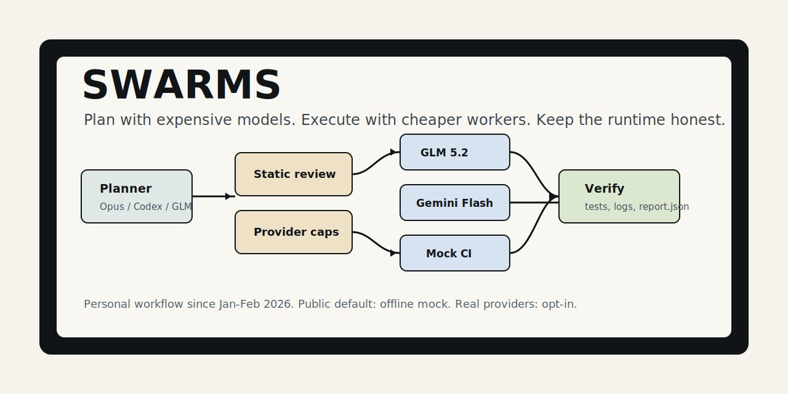
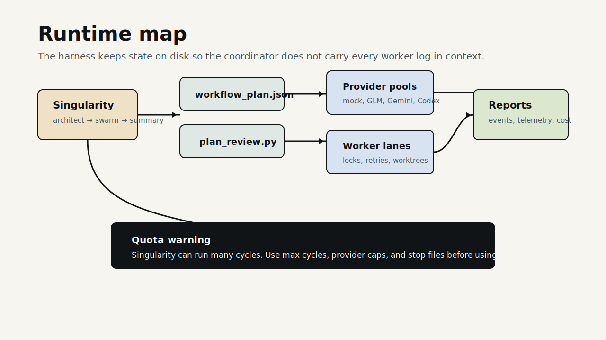

# SWARMS



Quota-saving orchestration for coding agents.

SWARMS plans work once, reviews the plan, then runs bounded worker pools across cheaper models, local checks, or an offline mock provider. I have used versions of this workflow personally since January-February 2026, when Ralph-style coding loops made the core idea obvious: keep strong models on planning and review, then let cheaper workers do the routine implementation.

The public repo keeps the default path offline. You can run the demo, tests, and CI with no keys. Real providers stay opt-in through local config.

Español: [README.es.md](README.es.md)

## What It Runs

- `scripts/swarm.py`: the public CLI for review, dry-run, and execution.
- `scripts/workflow_runtime.py`: deterministic task state, dependencies, locks, provider caps, events, results, and reports.
- `scripts/plan_review.py`: static plan checks before any worker runs.
- `scripts/parallel_swarm.ps1`: the older worktree runner with routing, watcher, retry, telemetry, and merge handling.
- `scripts/start_singularity.ps1`: a loop that asks an architect to create tasks, launches a swarm, summarizes the result, and repeats.
- `scripts/agy_call.py`: programmatic Antigravity/Gemini wrapper used where the CLI does not return a clean answer on stdout.
- `scripts/smart_router.py`: provider routing by role, directive, health, and local policy.
- `scripts/utils/token_telemetry.py`: token and cost event normalization across CLI outputs.

## Integrations Already In The Repo

SWARMS has code paths, routing names, docs, telemetry, or wrappers for:

- GLM 5.2 through OpenCode or Z.AI-style routes.
- Gemini 3.5 Flash through Antigravity CLI.
- Codex CLI for premium orchestration or escalation.
- Kilo and Aider-style worker wrappers in the legacy worktree runner.
- Local shell/test verification.
- Offline `mock` workers for CI, demos, and safe cloning.
- Codex, Claude/OpenCode skill distribution via `skills/swarms/`.
- Token/cost parsing for Codex logs, OpenCode logs, stdout-like CLI usage, cache reads, cache writes, and reasoning tokens.

The committed router enables only `mock`. That protects new users and keeps CI free. Your private routes live in `config/swarm_router.local.json`.

## Quick Start

Requires Python 3.10+ and Git.

```powershell
python scripts/swarm.py doctor
python scripts/swarm.py review --plan docs/workflow_plan_example.json
python scripts/swarm.py dry-run --plan docs/workflow_plan_example.json --force
python scripts/swarm.py run --plan docs/workflow_plan_example.json --force --global-max-concurrency 3 --provider-cap mock=3
```

Optional editable install:

```powershell
python -m pip install -e ".[dev,yaml]"
swarms doctor
swarms run --plan docs/workflow_plan_example.json --force --global-max-concurrency 3 --provider-cap mock=3
```

## Runtime Model



```text
goal
  -> workflow plan
  -> static review
  -> deterministic runtime
  -> provider pools under caps
  -> worker output
  -> verification and report.json
```

The runtime stores state under `.agent/swarm/runs/<run_id>/`. It keeps worker prompts, logs, task state, lifecycle events, result JSON, and final reports out of the coordinator context.

## Singularity Mode

Singularity is the self-feeding loop:

```powershell
pwsh scripts/start_singularity.ps1 -MaxCycles 5
```

Each cycle runs an architect phase, launches the swarm, records state, summarizes, and moves into the next cycle. It is useful when you want the system to keep decomposing and repairing a project without writing every task by hand.

Use it with caps. Singularity can spend a large number of tokens if you enable real providers, raise worker count, or let cycles run. Keep `STOP_SINGULARITY` ready, start with `mock-only`, and set low `MaxCycles` before using paid routes.

## Provider Policy

Default role intent:

- Planner: GLM 5.2 by default, Codex only when the plan justifies premium quota.
- Critic: GLM 5.2 first, Codex for high-risk or high-cost plans.
- Programmer: GLM 5.2 or Gemini Flash when configured.
- Verifier: local tests first, cheap model review second.
- Premium routes: explicit plan permission plus local config.

See `docs/PROVIDER_STATUS.md`, `docs/CONFIG.md`, and `docs/DYNAMIC_WORKFLOWS.md`.

## Origin

I built the first versions for personal use around January-February 2026. At the time I had student-plan constraints and wanted to stretch the models I could access: Gemini in Antigravity for worker loops, Opus for plans, and later GLM 5.2 and Codex for stronger planner/critic paths.

The product shape has stayed the same: spend scarce models on decisions, not on repetitive work.

## Safety

Do not commit:

- `.env`
- `config/*.local.json`
- API keys, OAuth tokens, auth files, or private credentials
- `.agent/`
- worktrees
- generated prompts, logs, traces, reports, or telemetry

The default workflow does not call paid APIs or external model providers.

## Verification

```powershell
python -m ruff check .
python -m py_compile scripts\swarm.py scripts\plan_review.py scripts\workflow_runtime.py scripts\doctor.py scripts\mock_worker.py
python -m pytest tests -q
python scripts/swarm.py doctor
python scripts/swarm.py run --plan docs\workflow_plan_example.json --force --run-id verify-readme --global-max-concurrency 3 --provider-cap mock=3
```

## License

MIT. See `LICENSE`.
