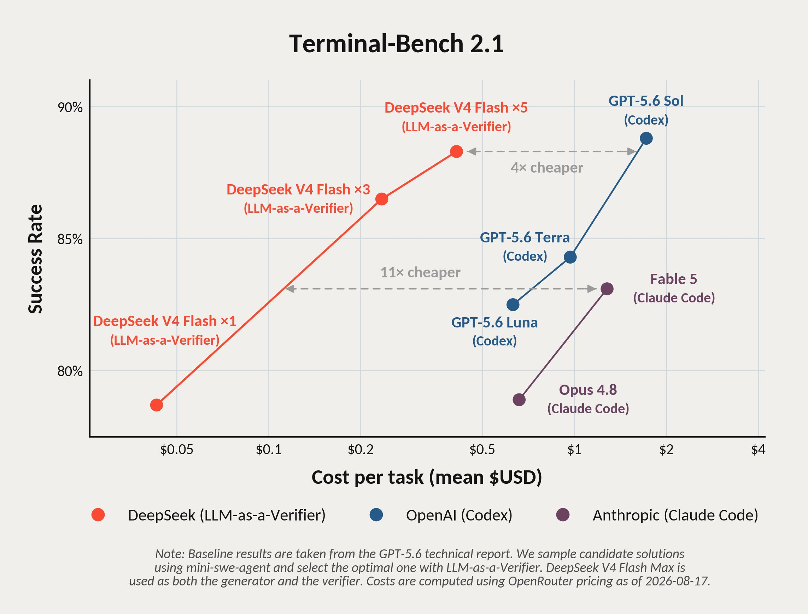

# SWARMS


> **Orchestrate coding-agent swarms across different harnesses, models, and providers.**
> SWARMS is the deterministic coordination layer above the agents you already use.

[](https://swarms-orchestrator.vercel.app/)
[](LICENSE)
[](https://github.com/Mchicao/swarm-driven-development)
[](README.es.md)

SWARMS is not another agent harness. It coordinates **multiple agent harnesses and provider routes in one workflow**. A planner can run through one tool, programmers through another, and reviewers through a third while the Rust runtime handles dependencies, concurrency, isolated Git worktrees, budgets, verification, and run state.

## Why SWARMS

The idea is simple: **build one swarm from the AI access you already have instead of rebuilding your workflow around one vendor**.

- Mix agents from different harnesses in the same DAG.
- Reuse the subscriptions, plans, quotas, and API access you already pay for.
- Connect routes exposed through a **CLI, HTTP API, SDK-backed adapter, or ACP bridge**.
- Choose which route plans, codes, reviews, or verifies.
- Put per-provider concurrency and budget limits around the whole swarm.
- Keep the committed default offline and safe until you explicitly configure real providers.

For example:

```text
goal
  -> planner: strong model through one CLI/API
  -> programmers: parallel agents through other harnesses
  -> reviewer: another route
  -> deterministic tests and verification
  -> validated result
```

This is especially useful when one AI plan gives you strong planning or review, while another gives you cheaper or higher-quota workers. SWARMS lets them work together instead of forcing the entire workflow through one harness.

## Origin

SWARMS started as a personal workflow around January-February 2026. I was working under student-plan constraints and wanted to stretch the models I could access: Gemini in Antigravity for worker loops, Opus for plans, and later GLM 5.2 and Codex for stronger planner/critic paths.

The idea grew from Ralph-style coding loops: keep scarce or expensive models on planning and review, then let cheaper or faster agents handle implementation, QA, issue triage, and repeated validation.

The principle is still the same: **spend scarce model capacity on decisions, not repetitive work**.

---

## The Proof: Cheap Models, Premium Results



**Scaling self-verification and parallel rollouts makes open-weight and budget models significantly more capable than frontier proprietary models at a fraction of the cost.**

### 1. Terminal-Bench 2.1 (DeepSeek V4 Flash)
- **79% → 88% Accuracy**: Sampling 5 candidate solutions with DeepSeek V4 Flash and ranking them with LLM-as-a-Verifier lifts benchmark performance from 79% to 88%.
- **11× Cheaper than Claude Fable 5**: Outperforms Claude Fable 5 at the same accuracy level while costing **11× less** (~$0.50/task vs ~$5.50/task).
- **4× Cheaper than Codex GPT-5.6 Sol**.

### 2. DeepSWE Benchmark (Together AI Research · Zain Hasan)
- **Single-shot**: GLM (69.0%) vs Claude Fable 5 (69.7%).
- **2 Candidates (Pass@2)**: GLM reaches **81.1%** (passing Fable 5's 77.1%).
- **4 Candidates (Pass@4)**: GLM hits **87.6%** (dominating Fable 5's 84.1%) at ~10× lower cost.

> Sources: [Together AI DeepSWE Research by Zain Hasan (@zainhas)](https://x.com/zainhas/status/2091297526347677701) and the [LLM-as-a-Verifier self-verification study](https://github.com/llm-as-a-verifier/llm-as-a-verifier#self-verification-terminal-bench-21).

---

## Core Capabilities & Features

### Parallel Test-Time Scaling
Run N candidate solutions simultaneously in parallel across isolated Git worktrees.
1. **Objective First**: Automated tests (`pytest`, `cargo test`, linters) run per candidate. If exactly one candidate passes, it wins with **zero extra LLM calls**.
2. **LLM-as-a-Verifier**: On ties, a verifier model can score candidates.
3. **Escalation**: Ambiguous cases can escalate to synthesis or review routes within bounded token budgets.

### Role Specialization
- **Planner**: Reserve your strongest route for workflow planning and difficult decisions.
- **Static Critic**: Validate DAG dependencies, cycles, routes, and budget constraints before execution begins.
- **Programmer Workers**: Fan implementation work out across faster, cheaper, or higher-quota routes.
- **Deterministic Verifier**: Grade code with compiler checks, unit tests, and SHA256 integrity hashes before relying on model judgment.

### Zero Workspace Contamination
Every programmer worker operates inside a detached, temporary Git worktree. Changes are cryptographically verified with SHA256 pre/post signatures before being merged to the primary workspace.

### Runaway & Silent-Hang Protection
Active log watchers monitor worker stdout and file activity. If a task goes silent or hangs, SWARMS triggers warnings and enforces timeouts, preventing zombie processes from consuming provider quota indefinitely.

### Swarm-Driven Development (SwDD)
Integrate with [SwDD](https://github.com/Mchicao/swarm-driven-development) to connect OpenSpec specifications, SWARMS execution, Gentle-AI orchestration, and Engram memory behind a unified workflow:

$$\text{Specification} \longrightarrow \text{Swarm Execution} \longrightarrow \text{Receipt-Backed Delivery}$$

---

## Quick Start in 30 Seconds

SWARMS is built in 100% native, self-contained Rust:

```bash
# 1. Check local environment and tools
cargo run --manifest-path rust/Cargo.toml -- doctor

# 2. Statically validate a workflow plan
cargo run --manifest-path rust/Cargo.toml -- review --plan docs/workflow_plan_example.json

# 3. Dry-run without side effects
cargo run --manifest-path rust/Cargo.toml -- dry-run --plan docs/workflow_plan_example.json --force

# 4. Execute with provider concurrency caps
cargo run --manifest-path rust/Cargo.toml -- run --plan docs/workflow_plan_example.json --force --global-max-concurrency 3 --provider-cap mock=3
```

---

## Supported Access Paths & Integrations

SWARMS adapts to how your AI access is exposed. You configure routes locally and assign them to roles in the swarm.

- **Harnesses & CLIs**: Claude Code, Codex CLI, OpenCode, Kilo Code, Hermes Agent, Antigravity CLI.
- **HTTP APIs**: OpenAI-compatible endpoints, LiteLLM gateways, OpenRouter, Z.AI, Nous Portal.
- **ACP**: ZCode through the community `zcode-acp-server` bridge.
- **SDK-backed adapters**: Provider-specific SDK integrations can sit behind the same adapter boundary when a generic CLI or HTTP route is not enough.
- **Offline / CI**: Self-contained `mock` provider for offline testing, demos, and CI/CD pipelines.
- **Observability & Telemetry**: Token normalization, cache reads/writes, reasoning effort tracking, and JSON reports in `.agent/swarm/runs/<run_id>/`.

SWARMS does not bundle model access or require one provider. Your own local configuration decides which plans, APIs, CLIs, SDK-backed adapters, and ACP routes are available to the swarm.

---

## Deep-Dive Technical Documentation

For developers seeking low-level runtime internals, schema specifications, and adapter implementation guides:

- [Rust Runtime Architecture](docs/RUST_RUNTIME.md) — Schedulers, locks, thinking levels, session affinity.
- [Parallel Test-Time Scaling Guide](docs/workflow_plan_scaling_example.json) — Scaled execution example with candidate rollouts.
- [Workflow State Contract](docs/STATE_CONTRACT.md) — Run-state JSON contracts and event schemas.
- [Provider & Route Configuration](docs/CONFIG.md) — Local overlays and provider limits.
- [Agent Standards & Prime Directives](AGENTS.md) — Guidelines for autonomous coding agents.

---

## License

MIT License. See [LICENSE](LICENSE) for details.
